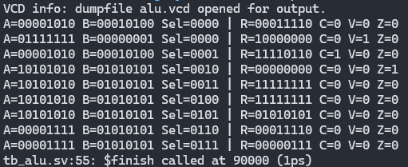
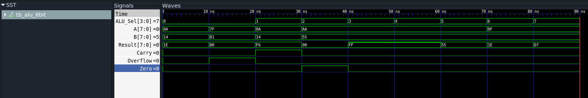

# 8-bit ALU (Arithmetic and Logical Unit) using systemverilog

* Inputs
    * Operand A
    * Operand B
    * Opcode (ALU_sel)
* Outputs
    * Result
    * Status flags
        * Carry
        * overflow
        * Zero
* Operation mapping
    * 0000 : ADD
    * 0001 : SUB
    * 0010 : AND
    * 0011 : OR
    * 0100 : XOR
    * 0101 : NOT A
    * 0110 : Shift Left
    * 0111 : Shift Right

### Output

### Waveform

