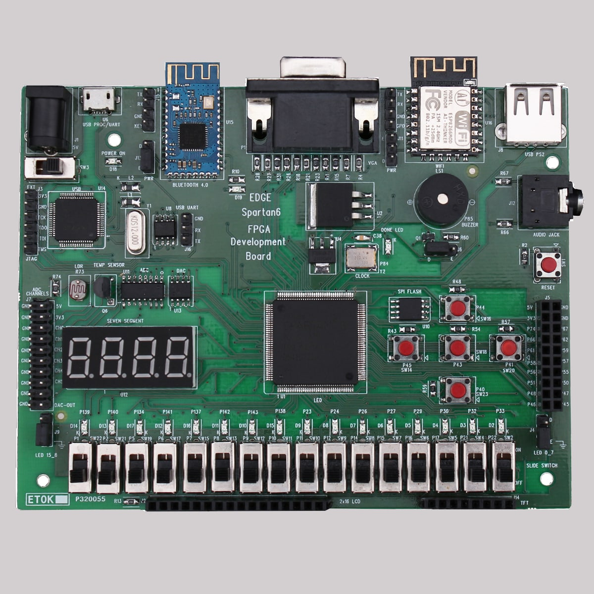
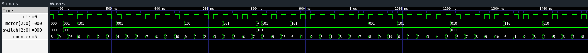

# FPGA based motor contoller using PWM (Pulse Width Modulation) signal

Objective - control motor speed and direction using fpga on board switches  

* Components Used
    * Spartan-6 fpga board
        

            
        

    * L298N Motor driver board (H-bridge)
* Input
    * Slide Switches at ports 22, 21, 17
    * Clock signal at port 84
* Ouptut
    * GPIO pins at 75, 74, 67 connected to In1, In2, ENA 
* Switch positions
    * 000 - Motor off
    * 001 - forward direction   -   pwm duty cycle 4/10
    * 011 - backward direction  -   pwm duty cycle 4/10
    * 101 - forward direction   -   pwm duty cycle 8/10
    * 111 - backward direction  -   pwm duty cycle 8/10
* Working
    * Use a counter which countes from 0-9 (10 steps) at every positive edge of clock
    * for 40% duty cycle count from 0-4 (4 steps out of 10).
    * for 80% duty cycle count from 0-8 (8 steps out of 10).

### Waveform

